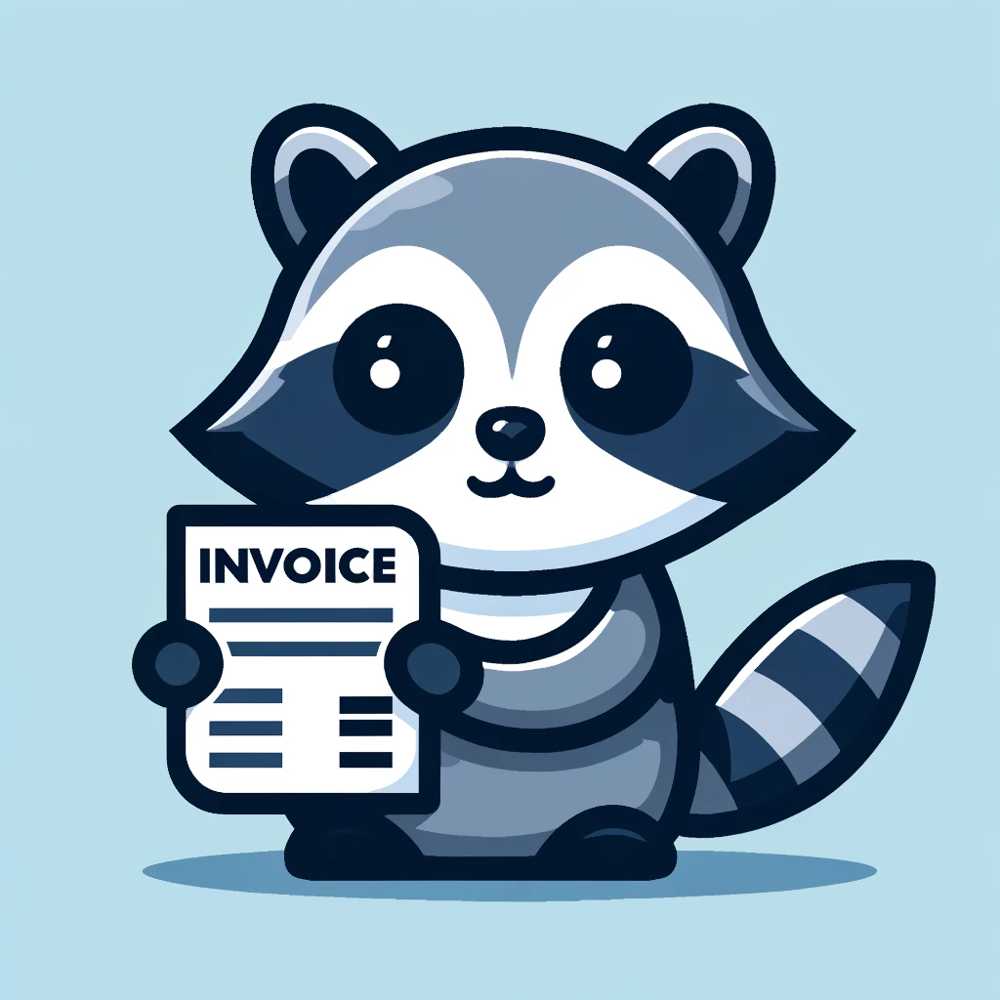

# InvoiceRacoon

## Overview

InvoiceRacoon is an AI-powered tool designed to automate the extraction of key information from invoices. Using advanced OCR and natural language processing technologies, InvoiceRacoon accurately reads and interprets invoice data, streamlining workflows and reducing the need for manual data entry. This tool is ideal for businesses looking to optimize their invoicing processes and enhance operational efficiency.

## Features

- **Intelligent Invoice Reading**: Automatically extracts critical fields such as invoice number, date, total amount, and itemized lists from invoices.
- **User-Defined Fields**: Customize the fields you want to extract based on your specific needs.
- **Accurate OCR**: High-precision optical character recognition to handle various invoice formats and styles.
- **AI-Powered Parsing**: Advanced natural language processing ensures accurate interpretation of the extracted data.
- **Seamless Integration**: Easily integrate with your existing systems via API for automated data transfer.
- **User-Friendly Interface**: A web interface that allows for easy invoice upload and data review.

## Usage

1. **Upload Invoices**: Use the web interface to upload invoice images or PDFs.
2. **Review Extracted Data**: Verify and, if necessary, correct the extracted information.
3. **Export and Integrate**: Export the data to your preferred format or integrate directly with your existing systems via the provided API.

## License

This repository is publicly accessible, but its usage is restricted.

1. **Viewing**: You may view the contents of this repository.
2. **Usage**: Usage of the code in this repository is prohibited unless explicit written permission is obtained from the author.
3. **Modification and Redistribution**: Modification and redistribution of the code are strictly prohibited without prior written consent from the author.
4. **Commercial Use**: For commercial use, you must purchase a license or obtain explicit permission from the author.

For permissions, licensing, and other inquiries, please contact us at:

CatDev  
Email: [contact@catdev.com.pl](mailto:contact@catdev.com.pl)

## Acknowledgements

Thanks to the community for the support and to the developers of the technologies that make InvoiceRacoon possible.
